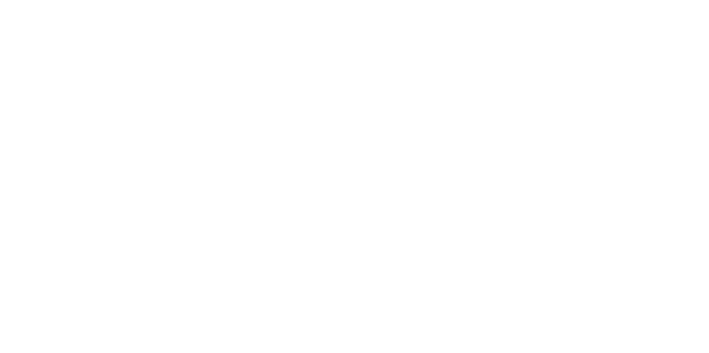

<p align="center">
  <a href="https://shieldcn.dev">
    
  </a>
</p>

<p align="center">
  Beautiful README badges.<br />
  A <a href="https://shields.io">shields.io</a> alternative styled as <a href="https://ui.shadcn.com">shadcn/ui</a> buttons. Never paywalled.
</p>

<p align="center">
  <a href="https://shieldcn.dev">Homepage</a> · <a href="https://shieldcn.dev/docs">Docs</a> · <a href="https://shieldcn.dev/docs/api-reference">API Reference</a>
</p>

<p align="center">
  <a href="https://github.com/jal-co/shieldcn/stargazers"></a>
  <a href="https://github.com/jal-co/shieldcn/network/members"></a>
  <a href="https://github.com/jal-co/shieldcn/blob/main/LICENSE"></a>
  <a href="https://github.com/jal-co/shieldcn/graphs/contributors"></a>
  <a href="https://github.com/jal-co/shieldcn/commits/main"></a>
</p>

## About

shieldcn is an open-source badge service by [Justin Levine](https://justinlevine.me). Every badge is free, every endpoint is public, and that's not changing.

Badges are rendered as actual [shadcn/ui](https://ui.shadcn.com) Button components via [Satori](https://github.com/vercel/satori) — same font (Inter), same border-radius, same padding, same color tokens per variant and size. Not "inspired by" — the real thing, as SVG.

Built with [jal-co/ui](https://ui.justinlevine.me) components.

## Usage

```md


```

## Badge types

### npm

| Badge | URL |
|-------|-----|
| Version | `/npm/{package}.svg` |
| Downloads | `/npm/{package}/downloads.svg` |

### GitHub

| Badge | URL |
|-------|-----|
| Stars | `/github/stars/{owner}/{repo}.svg` |
| Forks | `/github/forks/{owner}/{repo}.svg` |
| Watchers | `/github/watchers/{owner}/{repo}.svg` |
| Branches | `/github/branches/{owner}/{repo}.svg` |
| Releases | `/github/releases/{owner}/{repo}.svg` |
| Tags | `/github/tags/{owner}/{repo}.svg` |
| Latest tag | `/github/tag/{owner}/{repo}.svg` |
| License | `/github/license/{owner}/{repo}.svg` |
| Release | `/github/release/{owner}/{repo}[/stable].svg` |
| Contributors | `/github/contributors/{owner}/{repo}.svg` |
| CI status | `/github/ci/{owner}/{repo}.svg` |
| Checks | `/github/checks/{owner}/{repo}[/ref][/check].svg` |
| Issues | `/github/issues/{owner}/{repo}.svg` |
| Open issues | `/github/open-issues/{owner}/{repo}.svg` |
| Closed issues | `/github/closed-issues/{owner}/{repo}.svg` |
| Label issues | `/github/label-issues/{owner}/{repo}/{label}[/state].svg` |
| PRs | `/github/prs/{owner}/{repo}.svg` |
| Open PRs | `/github/open-prs/{owner}/{repo}.svg` |
| Closed PRs | `/github/closed-prs/{owner}/{repo}.svg` |
| Merged PRs | `/github/merged-prs/{owner}/{repo}.svg` |
| Milestones | `/github/milestones/{owner}/{repo}/{number}.svg` |
| Commits | `/github/commits/{owner}/{repo}[/ref].svg` |
| Last commit | `/github/last-commit/{owner}/{repo}[/ref].svg` |
| Asset downloads | `/github/assets-dl/{owner}/{repo}[/tag].svg` |
| Dependabot | `/github/dependabot/{owner}/{repo}.svg` |

### Discord

| Badge | URL |
|-------|-----|
| Online count | `/discord/{serverId}.svg` |

### Static & Dynamic

| Badge | URL |
|-------|-----|
| Static | `/badge/{label}-{message}-{color}.svg` |
| Dynamic JSON | `/badge/dynamic/json.svg?url=...&query=...` |

## Variants & sizes

Every badge supports shadcn Button variants and sizes:

```md


```

## Icons

Three icon libraries (40,000+ icons) plus custom SVG upload:

- **[Simple Icons](https://simpleicons.org)** — `?logo=react`
- **[Lucide](https://lucide.dev/icons)** — `?logo=lucide:star`
- **[React Icons](https://react-icons.github.io/react-icons/)** — `?logo=ri:FaReact`
- **Custom SVG** — `?logo=data:image/svg+xml;base64,...` — upload any SVG icon via the Badge Builder or encode it yourself

## Response formats

- **`.svg`** — SVG image (default, for READMEs and docs)
- **`.png`** — rasterized PNG
- **`.json`** — raw badge data
- **`/shields.json`** — shields.io-compatible endpoint

## Design principles

- **shadcn buttons, not shields.io rectangles** — badges are rendered as actual shadcn Button components with real Inter font outlines via Satori
- **Everything configurable** — variant, size, mode, colors, icons, opacity, split, dot — but sensible defaults so you don't have to configure anything
- **Shields.io compatible** — same URL patterns for static/dynamic badges, same text encoding, shields.io JSON endpoint support
- **Open source, never paywalled** — every badge type, every variant, every icon source is free

## Local development

```bash
pnpm install        # install dependencies
pnpm dev            # start dev server
pnpm build          # next build
```

## Token pool

shieldcn uses a [token pool](https://shieldcn.dev/token-pool) (inspired by [shields.io](https://shields.io/blog/2024-11-14-how-shields-io-uses-the-github-api)) to distribute GitHub API requests across many tokens. You can help by authorizing the OAuth app — read-only, zero scopes, revocable anytime.

## Analytics

shieldcn uses [OpenPanel](https://openpanel.dev/open-source?utm_source=shieldcn.dev) for privacy-friendly product analytics.

To enable it, set:

```bash
NEXT_PUBLIC_OPENPANEL_CLIENT_ID=...
OPENPANEL_CLIENT_SECRET=...
```

If those env vars are missing, analytics stays disabled.

## Credits

- **[shields.io](https://shields.io)** — the original badge service. Inspiration for URL patterns, static badge format, and the token pool system.
- **[badgen.net](https://badgen.net)** — inspiration for many badge types and endpoint structures, especially the GitHub badge coverage.
- **[shadcn/ui](https://ui.shadcn.com)** — the design system these badges are built on.
- **[Satori](https://github.com/vercel/satori)** — Vercel's JSX-to-SVG engine that makes rendering React components as badge images possible.
- **[jal-co/ui](https://ui.justinlevine.me)** — the component library powering the docs site.
- **[@k33bs](https://github.com/k33bs)** — creator of [shieldcngen](https://github.com/k33bs/shieldcngen), the badge generator tool powering the [`/gen`](https://shieldcn.dev/gen) page.

## Contributing

PRs welcome. See [AGENTS.md](./AGENTS.md) for architecture overview.

## License

[MIT](./LICENSE)
